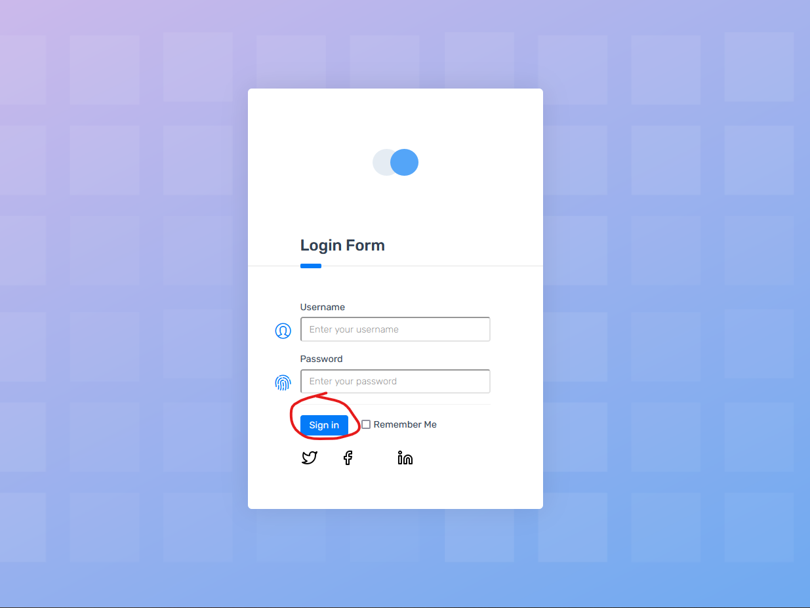

# #19395321 В форме авторизации кнопка входа работает независимо от введенных данных
**Предусловие:** открыть страницу https://demo.applitools.com/index.html в Mozilla Firefox 117.0.1

**Шаги:**

1. Нажать на кнопку Sign in под полями ввода логина и пароля

**ФР:** Происходит переход в личный кабинет пользователя https://demo.applitools.com/app.html

**ОР** Формы ввода выделяются красным, всплывает требование ввести логин и пароль.

**Серьезность:** Critical

**Приоритет:** High  

