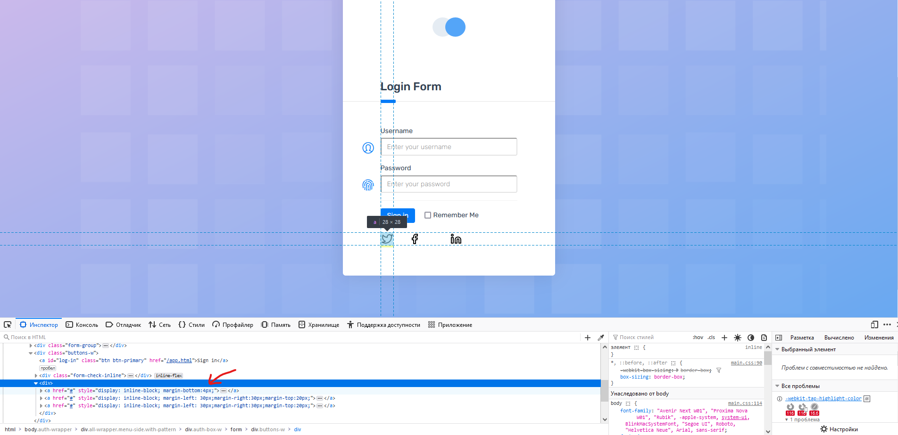

# #19395438 Иконки соцсетей находятся на разном расстоянии друг от друга в форме авторизации

**Предусловие:** открыть страницу https://demo.applitools.com/index.html в Mozilla Firefox 117.0.1

**Шаги:**

1. Нажать правой кнопкой мыши на иконку “Твиттер” и в появившемся меню выбрать пункт “Исследовать”

**ФР:** У иконки “Твиттер” отсутствует отступ 30px слева и справа.

**ОР:** Все иконки имеют отступ 30px слева и справа.

**Серьезность:** Trivial

**Приоритет:** Low  

